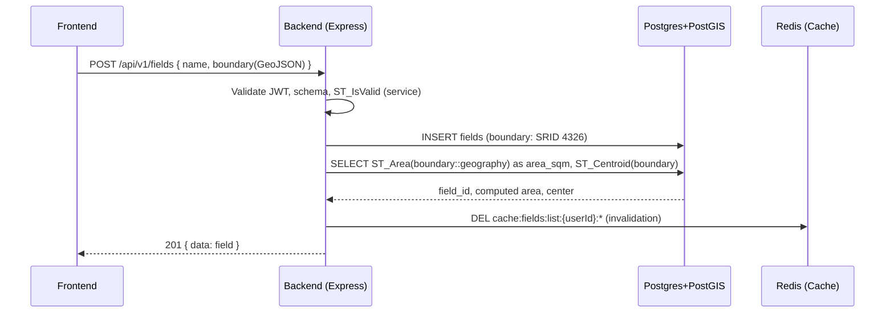
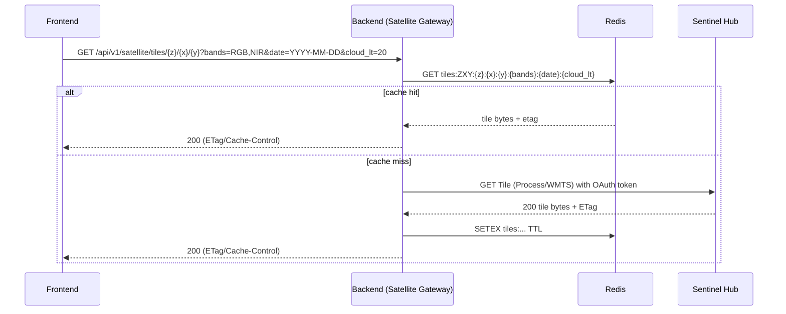
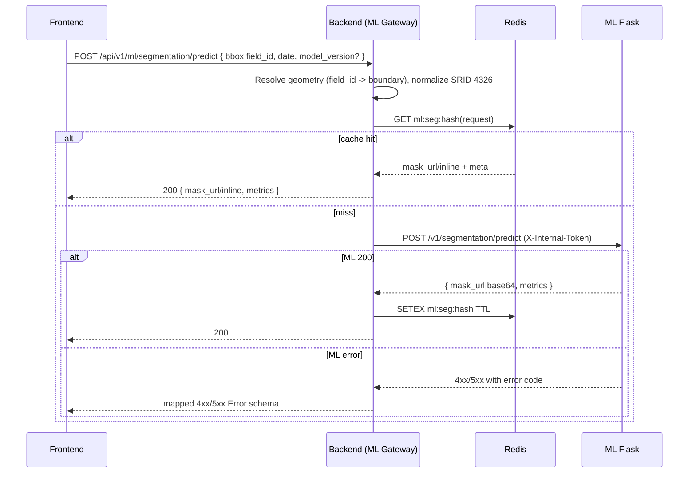
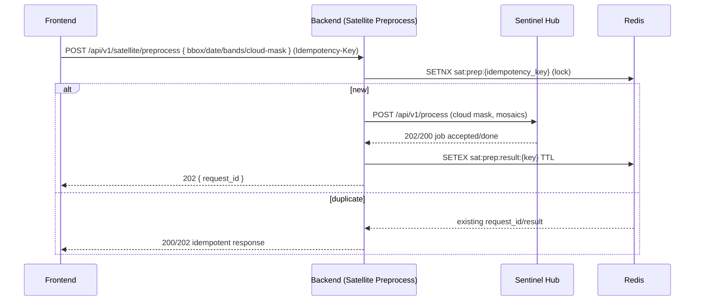

# SkyCrop — Sprint 2 Integration Plan

Owner: Architecture  
Scope: Authoritative plan for Backend ↔ ML integration, external satellite ingestion, spatial data handling, caching, errors, observability, security, and performance for Sprint 2.  
References:
- [`backend/src/api/openapi.yaml`](backend/src/api/openapi.yaml)
- [`backend/database/init.sql`](backend/database/init.sql)
- [`backend/src/models/field.model.js`](backend/src/models/field.model.js)
- [`backend/src/api/middleware/auth.middleware.js`](backend/src/api/middleware/auth.middleware.js)
- [`backend/src/api/middleware/validation.middleware.js`](backend/src/api/middleware/validation.middleware.js)
- [`backend/src/api/middleware/rateLimit.middleware.js`](backend/src/api/middleware/rateLimit.middleware.js)
- [`backend/src/utils/logger.js`](backend/src/utils/logger.js)
- Env template: [`backend/.env.example`](backend/.env.example)

## 1) System Context and Module Boundaries

- Frontend (React): Consumes Backend REST APIs, authenticated via Bearer JWT.
- Backend (Node.js/Express): Modular monolith exposing REST endpoints per [`backend/src/api/openapi.yaml`](backend/src/api/openapi.yaml). Core domains:
  - Auth & sessions (JWT) via [`backend/src/api/middleware/auth.middleware.js`](backend/src/api/middleware/auth.middleware.js)
  - Fields CRUD + spatial filters (SRID 4326) aligned with [`backend/src/models/field.model.js`](backend/src/models/field.model.js) and [`backend/database/init.sql`](backend/database/init.sql)
  - Satellite Gateway: Proxies Sentinel Hub Process/Tile APIs; caching in Redis
  - ML Gateway: Proxies internal ML Flask service (segmentation); handles auth, timeouts, retries
  - Weather Gateway: Already present (OpenWeather)
- Data Stores:
  - Postgres + PostGIS: Authoritative spatial data, health metrics, registry tables
  - Redis: Caching (weather, tiles, field lists, ML outputs), rate limiting keys, JWT blacklist
- ML Service (Python Flask): Internal-only API for segmentation. Contract in separate doc (created in this sprint).
- External Providers:
  - Sentinel Hub (imagery, indices inputs)
  - OpenWeather (already integrated)

Boundary principles:
- Backend is the single public API surface; ML is not exposed externally.
- All spatial writes/reads normalized to SRID 4326; area calculations use geography for m².
- All outbound calls go through gateway modules with standardized retries, timeouts, and structured logging.

## 2) Data Flow Diagrams (Mermaid)

### 2.1 Field CRUD (Create → Store → Return)

### 2.2 Satellite Tile Fetch (Cache-first)

### 2.3 ML Segmentation Predict (bbox or field_id)

### 2.4 Preprocessing Job (idempotent)

## 3) External Dependencies (Sentinel Hub focus)

- Auth Strategy:
  - OAuth 2.0 Client Credentials
  - Token Endpoint: https://services.sentinel-hub.com/oauth/token
  - Env: SENTINEL_HUB_CLIENT_ID, SENTINEL_HUB_CLIENT_SECRET in [`backend/.env.example`](backend/.env.example)
- APIs Planned:
  - Process API: https://services.sentinel-hub.com/api/v1/process (mosaicking, cloud mask)
  - Tiled/OGC for map tiles where applicable (WMTS/TMS) for z/x/y compatibility; Process fallback for precise bbox/date
- Bands: RGB, NIR, SWIR; indices computed by ML pipeline; cloud_lt parameter forwarded to upstream where applicable.
- Quotas/Rate Limits: Dependent on SH subscription; implement client-side budget:
  - Retries: exponential backoff with jitter for 429/5xx (up to 3 attempts; base 500ms; max 3s)
  - Timeouts: 10s per tile; 30s for process job submission
  - Circuit-breaker (counter in Redis) optional if consistent 5xx
- Observability of upstream:
  - Log request_id, status, latency_ms, quota headers if provided
  - Propagate Cache-Control/ETag where available

## 4) Caching Strategy (Redis)

Key prefixes and TTL targets:
- Field lists: keys `fields:list:{userId}:bbox={hash}|near={hash}|intersects={hash}:page={n}`; TTL 300s; invalidate on field write (create/update/delete)
- Fields by id: `fields:byId:{fieldId}` TTL 300s; invalidate on patch/delete/boundary update
- Satellite tiles: `tiles:{z}:{x}:{y}:{bands}:{date}:{cloud_lt}` TTL 6h; store bytes + ETag; Cache-Control public, max-age=21600
- Satellite preprocess: `sat:prep:lock:{idempotency_key}` (lock 5m), `sat:prep:result:{hash}` TTL 24h
- ML segmentation: `ml:seg:{sha256(request)}` TTL 24h; payload is mask_url (preferred) or base64 + minimal metadata
- Weather current/forecast: existing; ensure TTL alignment with [`backend/.env.example`](backend/.env.example)

Invalidation policies:
- On field writes: delete `fields:list:*` for user and `fields:byId:{id}`; optionally delete dependent tiles/masks if boundary changed (best-effort pattern delete with bounding box hash if tracked).
- ML models: cache key includes model_version; invalidate on registry update (future).

## 5) Error Taxonomy and Mapping

Canonical error schema: components.schemas.Error in [`backend/src/api/openapi.yaml`](backend/src/api/openapi.yaml)

- Validation (input): 400 BAD_REQUEST → code: VALIDATION_ERROR, details: Joi errors
- Auth:
  - 401 UNAUTHORIZED → code: AUTH_REQUIRED | INVALID_TOKEN | TOKEN_EXPIRED
  - 403 FORBIDDEN → code: INSUFFICIENT_PERMISSIONS
- Resource:
  - 404 NOT_FOUND → code: NOT_FOUND
  - 409 CONFLICT → code: CONFLICT (e.g., field name uniqueness)
- Rate limiting:
  - 429 TOO_MANY_REQUESTS → code: RATE_LIMIT_EXCEEDED (or AUTH_RATE_LIMIT_EXCEEDED for auth)
- Sentinel Hub upstream:
  - 400/422 → map to 502 with code: UPSTREAM_ERROR and provider: "sentinel_hub" when input is valid but upstream rejects domain-specific payload
  - 429/5xx → propagate 503 SERVICE_UNAVAILABLE with retry-after if present; code: UPSTREAM_RATE_LIMIT or UPSTREAM_UNAVAILABLE
- ML Service:
  - 400 → INVALID_INPUT
  - 404 → MODEL_NOT_FOUND
  - 504/408 → TIMEOUT
  - 502/503/500 → UPSTREAM_ERROR
- Include meta:
  - correlation_id, upstream_request_id, provider, latency_ms where applicable

## 6) Observability

- Correlation IDs:
  - Accept/propagate `X-Request-Id`, else generate UUID v4; include in all logs and responses (meta.correlation_id)
- Structured Logs (JSON) via [`backend/src/utils/logger.js`](backend/src/utils/logger.js)
  - Fields: timestamp, level, service, route, method, user_id (if available), correlation_id, duration_ms, status, error.code, provider, cache_hit
- Metrics (export via Prometheus endpoint in later sprint; counters/gauges now via logs):
  - API latency (p50/p95) by route
  - Cache hit rate by key prefix
  - ML inference latency_ms and tile_count
  - Sentinel upstream latency and error rates
  - Rate limit throttle count
- Tracing (future): propagation headers (traceparent) reserved; record correlation_id now to ease future tracing

## 7) Security Posture

- AuthN/Z:
  - Bearer JWT enforced via [`backend/src/api/middleware/auth.middleware.js`](backend/src/api/middleware/auth.middleware.js)
  - Role checks via requireRole/requireAnyRole
- Rate limiting:
  - General API limiter and strict Auth limiter via [`backend/src/api/middleware/rateLimit.middleware.js`](backend/src/api/middleware/rateLimit.middleware.js)
- Input validation:
  - Joi schemas via [`backend/src/api/middleware/validation.middleware.js`](backend/src/api/middleware/validation.middleware.js)
  - Spatial validation: ST_IsValid on boundary; reject self-intersections; optional ST_SnapToGrid tolerance
- Request size caps:
  - Recommend 2 MB default; 10 MB for satellite preprocess/ML inline masks; enforce at Express level per route group
- Secrets management:
  - .env for dev; Railway/AWS Secrets for prod; never commit secrets. See [`backend/.env.example`](backend/.env.example)
- Outbound egress:
  - Restrict to Sentinel/OpenWeather/ML internal; deny-all default in production firewall
- Data privacy:
  - Fields are tenant-scoped; enforce user_id ownership on all Field/Health accesses
- CORS: Allow configured origin only

## 8) Performance Budgets

- Backend API:
  - p95 <= 3s under 100 RPS (with Redis cache)
  - Field spatial queries with GIST: filters (bbox/near/intersects) <= 50 ms at 10k fields (warm cache, proper indexes)
- ML Inference:
  - p95 <= 60s (CPU) for 512×512 tiling with overlap=64; queue max concurrency=5
- Satellite Tiles:
  - Cache hit rate ≥ 70% on repeated views; upstream timeouts at 10s per tile
- Payload sizes:
  - Field list pages ≤ 1 MB
  - ML masks: prefer URL; avoid inline base64 > 2 MB in production

## 9) Spatial Policies

- Storage SRID: 4326 (lon/lat)
- Accurate area: compute with `ST_Area(boundary::geography)` (m²), store as area_sqm; derive hectares at presentation if needed
- Indexes: GIST on boundary, GIST on center; btree on (user_id,status)
- Validity: enforce ST_IsValid and NOT ST_IsEmpty; reject self-intersections; snapping tolerance for near-miss vertices (configurable)

## 10) Open Questions & Assumptions

- Sentinel instance/project configuration:
  - Need INSTANCE/collection defaults (S2L2A), mosaicking policy (mostRecent), evalscripts for bands/masks
- Env variables required in backend:
  - SENTINEL_HUB_TOKEN_URL (default https://services.sentinel-hub.com/oauth/token)
  - SENTINEL_HUB_BASE_URL (default https://services.sentinel-hub.com)
  - SATELLITE_TILE_TTL_SECONDS (default 21600)
  - ML_INTERNAL_TOKEN (shared secret for Backend→ML)
  - ML_BASE_URL (default http://ml:8000 in Docker; http://localhost:8000 locally)
- Idempotency:
  - Use header `Idempotency-Key` for preprocess; store lock and result in Redis
- Storage of tiles:
  - In-memory Redis only for Sprint 2; optional S3/R2 for persistence in future

## 11) Testability Hooks (explicit)

Backend ↔ ML Contract Tests (to be implemented in Backend test suite):
- Positive: bbox request, field_id request, explicit model_version, default model fallback, cloud coverage warning passthrough
- Negative: INVALID_INPUT (bad bbox), MODEL_NOT_FOUND, TIMEOUT (simulate delayed ML), UPSTREAM_ERROR
- Headers: X-Model-Version echo, X-Request-Id propagation, X-Internal-Token required for ML

Mock Data Strategies:
- Sentinel: stubbed HTTP responses for tiles/process; deterministic PNG bytes and ETag
- ML: local Flask stub mode returning deterministic GeoJSON mask for a fixed bbox/date
- Redis: in-memory test Redis or mock client with known keys and TTL assertions

Seed Data Plan:
- Two sample fields (small valid polygons in SRID 4326, area ~0.5–1.0 ha), inserted via SQL or seed script
- Provide bbox that overlaps those fields for intersects tests

## 12) Risks & Mitigations

- Sentinel Hub quotas/latency:
  - Cache-first for tiles; batch preprocess in background; exponential backoff and circuit-breaker on 5xx/429
- Geometry validity issues:
  - Strict validation using ST_IsValid; optional ST_SnapToGrid before final reject; return actionable errors to UI
- ML inference time:
  - Tiling and overlap; CPU baseline measurements; queue depth limit (5); optional batching in ML for adjacent tiles
- Hot paths:
  - Ensure Redis warmup; precompute field centroids; paginate Field list; use bounding boxes for quick prefilter

## 13) Implementation Notes Alignment

- Align routes and schemas with OpenAPI updates delivered in patch (see: [`Doc/System Design Phase/openapi-sprint2.patch.md`](Doc/System Design Phase/openapi-sprint2.patch.md))
- SRID policy and DDL changes captured in data schemas doc (see: [`Doc/System Design Phase/data_schemas_postgis_sprint2.md`](Doc/System Design Phase/data_schemas_postgis_sprint2.md))
- ML contracts detailed here: [`Doc/System Design Phase/ml_service_contracts_sprint2.md`](Doc/System Design Phase/ml_service_contracts_sprint2.md)
